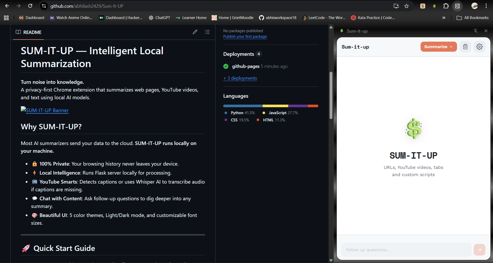

# SUM-IT-UP — Intelligent Local Summarization

**Turn noise into knowledge.**  
A privacy-first Chrome extension that summarizes web pages, YouTube videos, and text using local AI models.



## Why SUM-IT-UP?

Most AI summarizers send your data to the cloud. **SUM-IT-UP runs locally on your machine.**

- 🔒 **100% Private**: Your browsing history never leaves your device.
- ⚡ **Local Intelligence**: Runs Flask server locally for processing.
- 📺 **YouTube Smarts**: Detects captions or uses Whisper AI to transcribe audio if captions are missing.
- 💬 **Chat with Content**: Ask follow-up questions to dig deeper into any summary.
- 🎨 **Beautiful UI**: 5 color themes, Light/Dark mode, and customizable font sizes.

---

## Screenshots


## 🚀 Quick Start Guide

**Important: Because this extension runs locally, you MUST have the python server running for it to work.**

### Prerequisites
1. **Python 3.10+** installed ([Download](https://www.python.org/downloads/))
2. **Google Gemini API Key** (Free tier is fine) — [Get Key](https://aistudio.google.com/app/apikey)
3. **FFmpeg** (For YouTube audio processing) — [Install Guide](https://www.ffmpeg.org/download.html)

### Step 1: Clone & Setup Backend

Open your terminal/command prompt:

```bash
# 1. Clone the repository
git clone https://github.com/abhilash2429/Summa.git
cd Summa

# 2. Install dependencies
pip install -r requirements.txt

# 3. Set up your API Key
# Create a file named .env (dot-env) in this folder
# Add this line to it:
GEMINI_API_KEY=your_actual_api_key_here
```

### Step 2: Start the Local Server

**You must keep this terminal window open while using the extension.**

```bash
python server.py
# You should see: "Running on http://127.0.0.1:5000"
```

### Step 3: Load the Extension in Chrome

1. Open Chrome and go to `chrome://extensions/`
2. Toggle **Developer mode** (top right corner).
3. Click **Load unpacked**.
4. Select the `extension` folder inside the project directory.
5. Pin the **SUM-IT-UP** icon to your toolbar!

---

## 💡 How to Use

1. **Ensure Server is Running**: Check your terminal. If `python server.py` isn't running, the extension controls will be disabled or show an error.
2. **Web Pages**: Navigate to any article, click the **SUM-IT-UP** icon, and hit "Summarize".
3. **YouTube**: Open a video, click the extension. It will detect captions automatically.
4. **Custom Text**: Paste any text into the "Custom Text" tab to summarize it.
5. **Follow-up**: After a summary, use the chat box at the bottom to ask questions.

---

## ⚙️ Customization

Click the **Settings (gear icon)** in the extension to:
- Change **Summary Length** (Short, Medium, Long, Detailed).
- Switch **Color Themes** (Blue, Purple, Orange, Green, Slate).
- Adjust **Font Size**.
- Toggle **Light/Dark Mode**.

---

## ❓ Troubleshooting

**"Server not connecting" / Red error dot**  
👉 **Crucial Step:** Make sure the black terminal window with `python server.py` is still running. The extension communicates with this local server to process data.

**"Model not found" error**  
👉 Check your `.env` file. Ensure `GEMINI_API_KEY` is correct and has no extra spaces.

**YouTube summary failed**  
👉 Ensure FFmpeg is installed and added to your system PATH. This is required for downloading audio from videos without captions.

---

## 📜 License

MIT License. Built with ❤️ by [Abhilash](https://github.com/abhilash2429).
